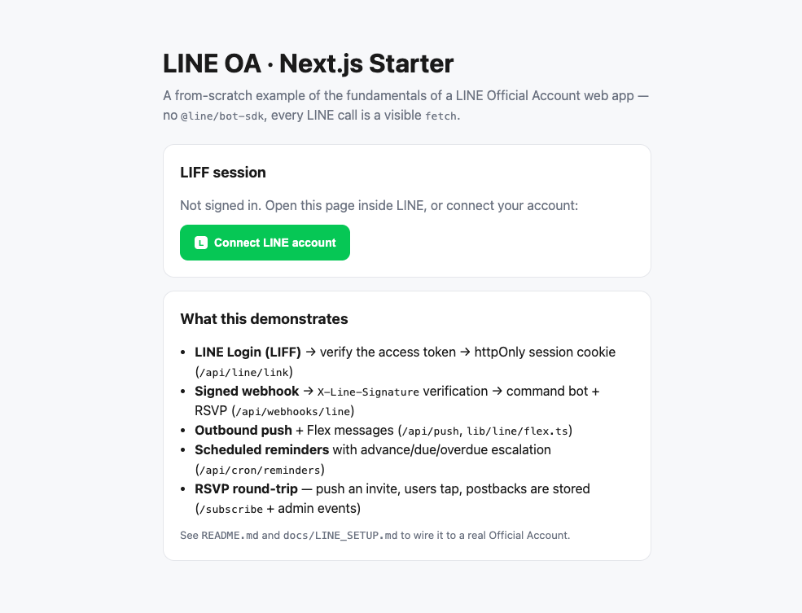

# LINE OA · Next.js Starter

A **self-contained, from-scratch example** of the fundamentals of a [LINE Official Account](https://www.linebiz.com/) web app, built on **Next.js 15** (App Router) + **Supabase**.

It is deliberately **not** built on `@line/bot-sdk` — every call to the LINE platform is a plain `fetch`, so nothing is a black box. You can read the ~10 lines that verify a webhook signature, the ~15 lines that push a message, and the OAuth-token exchange that turns a LINE login into a session. Fork it, rename the domain, and you have a working LINE web app.

> Extracted and generalized from a production system. The business domain has been stripped out; what remains is the reusable LINE plumbing. Want to see these fundamentals embedded in a full production-shaped system instead? See **[NEDP](https://github.com/jjnnaappaatt/NEDP)** — a Thai national elderly-screening platform with the same LINE plumbing plus real dashboards, scoring, and exports.



---

## What it demonstrates

| Fundamental | Where |
|---|---|
| **LINE Login (LIFF)** → verify the access token against your channel → httpOnly session cookie | `components/line/LiffProvider.tsx`, `app/api/line/link/route.ts` |
| **Signed inbound webhook** → `X-Line-Signature` HMAC verification → event dispatch | `app/api/webhooks/line/route.ts`, `lib/line/webhook.ts` |
| **Outbound push** + **Flex messages** | `lib/line/push.ts`, `lib/line/flex.ts` |
| **Command bot** with a fuzzy matcher + serverless conversation state | `lib/line/webhook.ts`, `lib/line/fuzzy.ts` |
| **Human handoff** — "talk to a human" pauses the bot (TTL) so staff reply from the OA Manager console | `lib/line/webhook.ts` (`cmdHuman`, `isHandedOff`), `lib/line/fuzzy.ts` |
| **Scheduled reminders** with advance → due → overdue escalation | `lib/line/reminders.ts`, `app/api/cron/reminders/route.ts` |
| **RSVP round-trip** — push an invite, user taps, postback is stored | `lib/line/flex.ts` (`eventInviteFlex`), `lib/line/webhook.ts` (`handleRsvp`), `lib/data/events.ts` |
| **One-tap subscribe** from inside LINE | `app/subscribe/page.tsx`, `app/api/line/subscribe/route.ts` |

## Architecture at a glance

```
                    ┌───────────────── LINE Platform ─────────────────┐
                    │  Messaging API   ·   LINE Login   ·   LIFF       │
                    └───────┬───────────────┬──────────────────┬──────┘
             push / reply   │      webhook  │        login /   │
             (Bearer token) │  (X-Signature)│    access token  │
                    ┌───────▼───────────────▼──────────────────▼──────┐
                    │              Next.js app (this repo)             │
                    │                                                  │
                    │  lib/line/push.ts     fetch client + HMAC verify │
                    │  app/api/webhooks/*   inbound events → bot       │
                    │  app/api/line/*       login / subscribe          │
                    │  app/api/cron/*       scheduled reminders        │
                    │  lib/data/*, lib/supabase/server.ts  (service    │
                    │                        role → auth.uid() is NULL)│
                    └───────────────────────┬──────────────────────────┘
                                            │
                                   ┌────────▼────────┐
                                   │    Supabase     │  self-contained schema
                                   │   (Postgres)    │  (supabase/migrations)
                                   └─────────────────┘
```

## Quickstart

**1. Install**

```bash
git clone https://github.com/jjnnaappaatt/line-oa-nextjs-starter.git
cd line-oa-nextjs-starter
npm install
cp .env.example .env.local     # fill in as you go — everything is optional at first
```

**2. Run (no LINE / no DB yet)**

```bash
npm run dev        # http://localhost:3000
```

The app boots and degrades gracefully with nothing configured: the login button is a no-op, pushes log `line_token_not_set`, and the webhook still returns 200. This "additive" property is on purpose — you can wire things up one at a time.

**3. Wire up LINE + Supabase**

Follow **[docs/LINE_SETUP.md](docs/LINE_SETUP.md)** to create the two LINE channels (Messaging API + LINE Login/LIFF) and get your tokens, then apply the database schema:

```bash
# with the Supabase CLI, from the project root:
supabase db push          # applies supabase/migrations/*.sql
# — or paste the migration files into the Supabase SQL editor.
```

Set `NEXT_PUBLIC_DATA_SOURCE=supabase` plus the Supabase + LINE vars in `.env.local`, restart `npm run dev`, and expose your local server so LINE can reach the webhook (e.g. `ngrok http 3000`), then set the Webhook URL in the LINE console to `https://<public-host>/api/webhooks/line`.

**4. Try it**

- Add your OA as a friend → the bot greets you (`follow` event).
- Type `help`, `status`, `my projects` → the fuzzy command matcher replies.
- Send a push: `curl -X POST http://localhost:3000/api/push -H "Authorization: Bearer $ADMIN_SECRET" -H "Content-Type: application/json" -d '{"to":"<your LINE userId>","text":"Hello!"}'`
- Create + send an event (admin) → tap **Attending** in LINE → the RSVP is stored.

## Project structure

```
app/
  api/line/link          LINE Login: verify LIFF token → session cookie
  api/line/subscribe     one-tap subscribe to a project
  api/webhooks/line      signed inbound webhook
  api/push               demo: send a text push (admin-gated)
  api/cron/reminders     scheduled reminder pass (CRON_SECRET + send-hour gate)
  api/admin/*            line-check · send-reminder · reminder-preview · events
  page.tsx               demo home (LIFF status)
  subscribe/page.tsx     LIFF one-tap subscribe page
  submit, status         placeholder deep-link targets
lib/line/
  push.ts                Messaging API client + verifyLineSignature (no bot-sdk)
  flex.ts                Flex message builders (statusFlex, eventInviteFlex)
  liff.ts                LIFF deep-link helper
  webhook.ts             inbound event handler (commands, issues, RSVP)
  fuzzy.ts               language-agnostic command matcher
  reminders.ts           advance/due/overdue escalation engine
lib/data/                visible data layer (settings, session, events, reminders)
lib/supabase/server.ts   service-role client
lib/time.ts              timezone / calendar helpers (configurable offset)
supabase/migrations/     the self-contained schema + one demo RPC
docs/                    LINE_SETUP · ARCHITECTURE · RICH_MENU
```

## Why no `@line/bot-sdk`?

The SDK is great for production, but it hides exactly the parts a learner needs to see. Here the signature check, the push call, and the token verification are all a few readable lines. Once you understand them, swapping in the SDK (or another language) is trivial. See [docs/ARCHITECTURE.md](docs/ARCHITECTURE.md).

## Deploy

Deploys to Vercel as-is. `vercel.json` registers a daily cron for `/api/cron/reminders`; set `CRON_SECRET` in your Vercel env. Because delivery is gated to the `send_hour` in your `settings` row, the cron does nothing until that hour. For **sub-daily** control (Vercel Hobby only allows daily cron), use an external hourly scheduler — [docs/LINE_SETUP.md](docs/LINE_SETUP.md) shows the Supabase `pg_cron` approach.

## Security notes

- **No secrets are committed.** Everything is read from `process.env`; `.env.local` is git-ignored. Copy `.env.example`, never commit real values.
- The **service-role** Supabase key is server-only (`lib/supabase/server.ts`), never shipped to the browser. Because it bypasses RLS, `auth.uid()` is NULL — that's why writes pass identity explicitly (see the `web_line_subscribe` function and [docs/ARCHITECTURE.md](docs/ARCHITECTURE.md)).
- The demo admin endpoints use a single shared secret (`ADMIN_SECRET`). Replace with real auth/roles for anything beyond a demo.

## Contributing

Contributions are welcome — especially fixes and doc clarifications that keep the fundamentals easy to
read. Please see [CONTRIBUTING.md](CONTRIBUTING.md) for the guiding principles (visible-over-clever, no
`@line/bot-sdk`, minimal deps) and the dev / PR checklist.

## License

[MIT](LICENSE) — free to learn from, fork, and build on.
